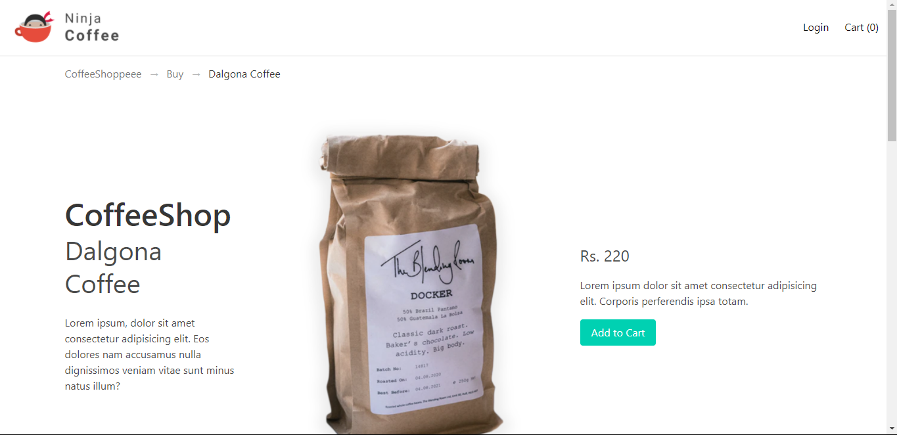
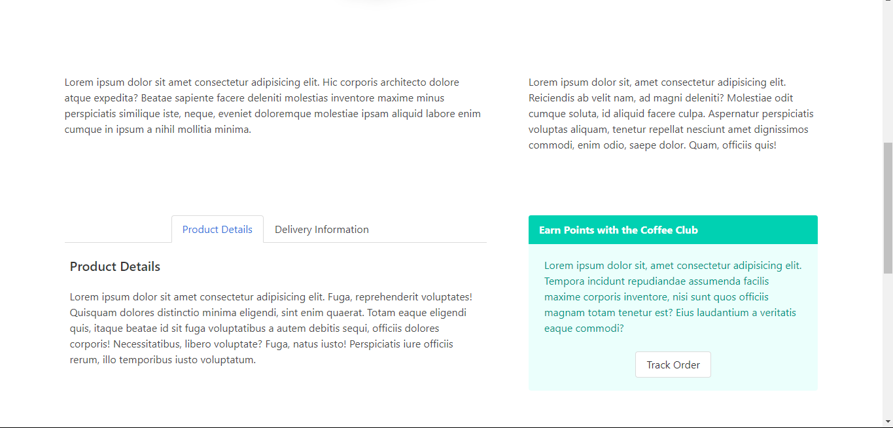
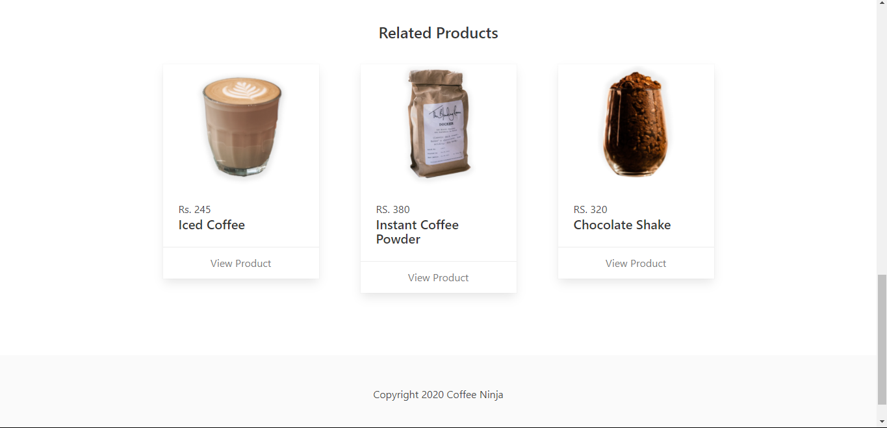
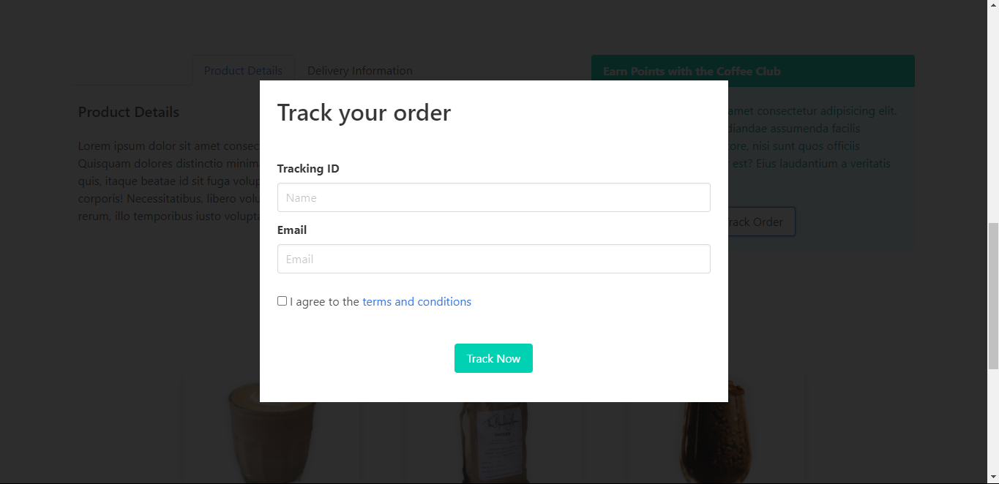

# Bulma-Landing-Page
A CoffeeShop Landing Page developed using Plain Bulma framework.

#### ScreenShots

## NOTES
#### Screen Sizes

Property | Screen Size
--------------|------------------
 mobile | 0 - 768 
 tablet | 769 - 1024 
 desktop | 1024-1216
 widescreen | 1216-1408
 fullhd | 1408 and above

#### Colour

Property |
--------------|
.is-primary |
.is-link |
.is-info |
.is-success |
.is-warning |
.is-danger |

#### Size

Property |
--------------|
.is-outlined |
.is-loading |

#### State

Property |
--------------|
.is-small |
.is-medium |
.is-large |

#### Typography Helpers

Property | Size 
--------------|------------
.is-size-1 | 3rem
.is-size-2	| 2.5rem
.is-size-3	| 2rem
.is-size-4	| 1.5rem
.is-size-5	| 1.25rem
.is-size-6	| 1rem
.is-size-7	| 0.75rem

#### Aligning

Property | Description
--------------|------------
.has-text-centered	| Makes the text centered
.has-text-justified	| Makes the text justified
.has-text-left.	| Makes the text align to the left
.has-text-right	| Makes the text align to the right

#### transform

Property | Description
--------------|------------
.is-capitalized	| Transforms the first character of each word to uppercase
.is-lowercase	| Transforms all characters to lowercase
.is-uppercase	| Transforms all characters to uppercase

#### Notes and Things to Remember

Property | Description
--------------|------------------
is-hidden-mobile  | hides the section in mobile devices